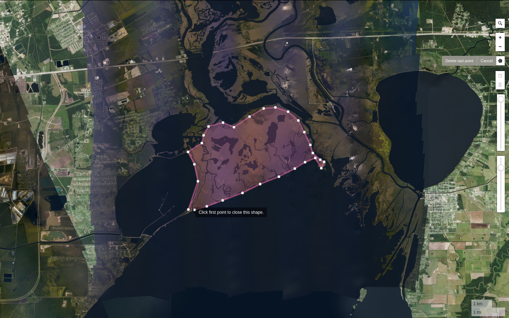

# selection



---

## **Usage**

Install dependencies  
`cd map; npm install`

Start webserver   
`python3 -m http.server -d selection`

Open url  
`$BROWSER 0.0.0.0:8000/map`

---

## **Config**
[config.json](config.json)
```c
{
    "zoom_level": int,    // starting zoom level
    "focus": {
        "lat": int,       // starting focus lat
        "lng": int        // starting focus lng
    }, 
    "tile_ids": [         // NOAA tile ids
        string
    ],
    "export_url": string  // polygon export server
}
```